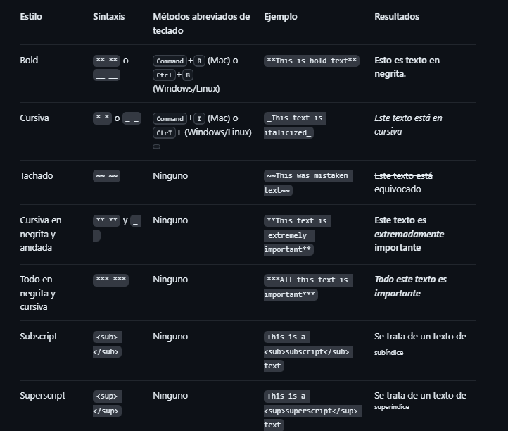
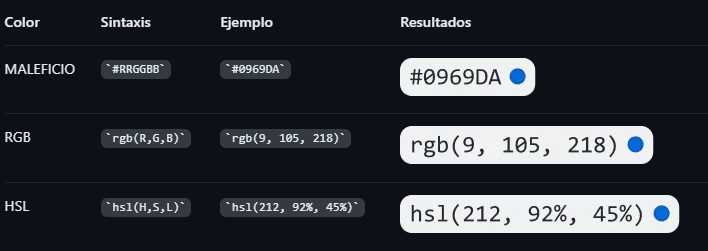
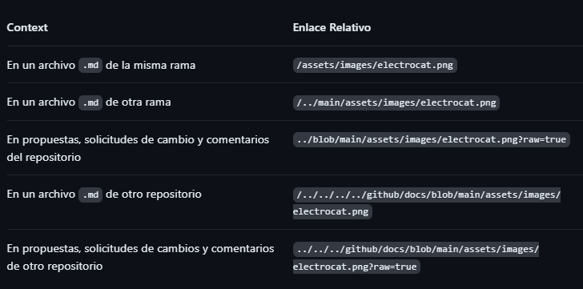

MANUAL MD

# 1. Encabezados

Para crear un encabezado, agrega entre uno y seis símbolos # antes del encabezado del texto. El número de # que utilices determinará el nivel jerárquico y el tamaño tipográfico del encabezado.

# Ejemplo 1 - Nivel mas grande

## Ejmeplo 2

### Ejemplo 3

# 2. Estilos de texto

Puedes indicar énfasis con texto en negrita, cursiva, tachado, o de subíndice o superíndice en los campos de comentarios y archivos .md.



# 3. Entrecomillado de texto

Puede entrecomillar texto con >.

Ejemplo

> Texto con entrecomillado

Al texto entre comillas se le ha aplicado sangría y tiene un color de tipo diferente.

# 3. Código de cita

Puedes indicar un código o un comando dentro de un enunciado con comillas simples. El texto dentro de las comillas simples no será formateado. También puedes presionar el método abreviado de teclado Comando+E (Mac) o Ctrl+E (Windows o Linux) para insertar las comillas simples de bloque de código en una línea de Markdown.

Ejemplo `git status` descripcion de lo que hace

Para formatear código o texto en su propio bloque distintivo, usa comillas triples.

Algunos comandos básicos de Git son:

```
estado de git
agregar git
git comprometerse
```

# 4. Modelos de color compatibles

En los problemas, las solicitudes de incorporación de cambios y los debates, puedes llamar a los colores dentro de una oración mediante comillas simples. Un modelo de color compatible dentro de las comillas simples mostrará una visualización del color.

El color de fondo es `#ffffff` para el modo claro y `#000000` para el modo oscuro.

Estos son los modelos de color admitidos actualmente.



# 5. Vinculos

Puede crear un vínculo en línea escribiendo su texto entre corchetes [ ] y escribiendo la URL entre paréntesis ( ). También puede usar el método abreviado de teclado Command+K para crear un vínculo. Cuando haya seleccionado texto, puede pegar una dirección URL del Portapapeles para crear automáticamente un vínculo a partir de la selección.

This site was built using [You Tube Amarillo](https://es.pornhub.com/).

# 6. Imágenes

Puede mostrar una imagen agregando ! y ajustar el texto alternativo en [ ]. El texto alternativo es un texto corto equivalente a la información de la imagen. Luego, escribe el vínculo de la imagen entre paréntesis ().


Aquí tienes algunos ejemplos para utilizar enlaces relativos para mostrar una imagen.



# 7. Listas

Puedes crear una lista sin ordenar. Para ello, coloca -, * o + antes de una o más líneas de texto.

- George Washington
* John Adams
+ Thomas Jefferson

Para ordenar tu lista, antecede cada línea con un número.

1. James Madison
2. James Monroe
3. John Quincy Adams

# 8. Listas Anadidas

Puedes crear una lista anidada al dejar sangría en uno o más elementos de la lista debajo de otro elemento.

Para crear una lista anidada mediante el editor web en GitHub o un editor de texto que usa una fuente monoespaciada, como Visual Studio Code, puedes alinear la lista visualmente. Escribe los caracteres con espacio frente al elemento de la lista anidada hasta que el carácter del marcador de lista (- o *) se encuentre directamente debajo del primer carácter del texto en el elemento que se encuentra debajo.

1. First list item
   - First nested list item
     - Second nested list item
         - Hola
   - Ejemplo

# 9. Lista de Tareas

Para crear una lista de tareas, debe añadir como prefijo un guion y espacio, seguido de [ ] a los elementos de la lista. Para marcar una tarea como completada, use [x].

- [x] #739
- [ ] https://github.com/octo-org/octo-repo/issues/740
- [ ] Add delight to the experience when all tasks are complete :tada:

Si la descripción de un elemento de la lista de tareas comienza por un paréntesis, necesitará agregar el carácter de escape \:

- [ ] \(Optional) Open a followup issue


@octocat :+1: This PR looks great - it's ready to merge! :shipit:

# 10. Emojis

Puedes agregar emoji a la escritura escribiendo :EMOJICODE:, dos puntos seguidos del nombre del emoji.

@octocat :+1: This PR looks great - it's ready to merge! :shipit:

Escriba : mostrará una lista de emojis sugeridos. La lista se filtrará a medida que escriba, por lo que una vez que encuentre el emoji que está buscando, pulse Tab o Entrar para completar el resultado resaltado.

Para obtener una lista completa de los códigos y emoji disponibles, consulta [la hoja de referencia de emojis](https://github.com/ikatyang/emoji-cheat-sheet/blob/master/README.md)
Párrafos

# 11. Notas al Pie
Puedes agregar notas al pie para tu contenido si utilizas esta sintaxis de corchetes:

Here is a simple footnote[^1].

A footnote can also have multiple lines[^2].

[^1]: My reference.
[^2]: To add line breaks within a footnote, prefix new lines with 2 spaces.
  This is a second line.

# 12. Alertas
Las alertas son una extensión Markdown basada en la sintaxis blockquote que puede utilizar para resaltar la información crítica. En GitHub, se muestran con colores e iconos distintivos para indicar la importancia del contenido.

Deben usarse las alertas solo cuando sean cruciales para el éxito del usuario y limitarlas a una o dos por artículo para evitar sobrecargar al lector. Además, debe evitarse colocar alertas consecutivamente. Las alertas no se pueden anidar dentro de otros elementos.

Para agregar una alerta, debe usarse una línea blockquote especial que especifique el tipo de alerta, seguida de la información de alerta en un blockquote estándar. Existen cinco tipos de alertas.

> [!NOTE]
> Useful information that users should know, even when skimming content.

> [!TIP]
> Helpful advice for doing things better or more easily.

> [!IMPORTANT]
> Key information users need to know to achieve their goal.

> [!WARNING]
> Urgent info that needs immediate user attention to avoid problems.

> [!CAUTION]
> Advises about risks or negative outcomes of certain actions.

# 13. Comenarios
Puedes decirle a GitHub que oculte el contenido del lenguaje de marcado interpretado colocando el contenido en un comentario de HTML.

<!-- This content will not appear in the rendered Markdown -->

# PARA MAS INFORMACION ACCEDA AL SIGUIENTE ENLACE
- [Manual MarkDown](https://docs.github.com/es/get-started/writing-on-github/getting-started-with-writing-and-formatting-on-github/basic-writing-and-formatting-syntax#headings)
